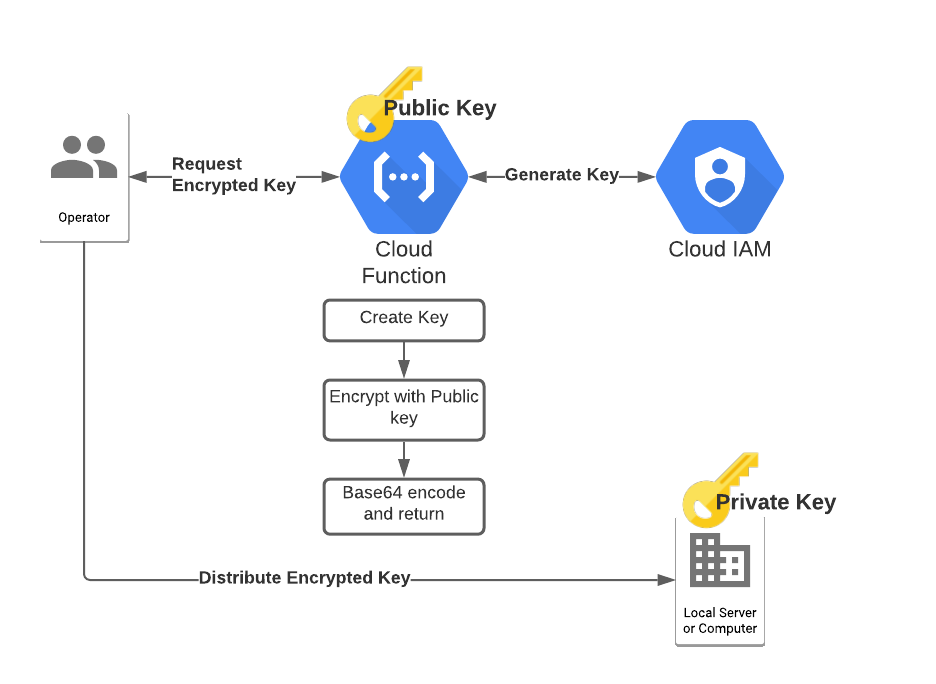

# Service Account Key Distributor

Downloading Google Cloud Service Account keys is [typically a bad idea](https://medium.com/@jryancanty/stop-downloading-google-cloud-service-account-keys-1811d44a97d9) but sometimes you can't help it.
For example if you need to create a key to distribute to a CICD system on-prem like Jenkins, or you need to give some third party
access to Google Cloud without giving them a user account. If you download the key and directly distribute it, not only is it
directly visible to you, but it's in plain text in whatever storage medium you put it in (i.e. GCS, etc). A better idea would
be to use [GPG](https://gnupg.org/) to download the key and encrypt it such that only the intended party can decrypt it. However,
in this case, the person downloading the key still has access to see it, which means they could accidentally commit it to Github,
send it off to a friend, etc.

This solution allows operators to generate a Google Cloud service account key for another system (e.g. CICD pipeline) or user without
ever needing to see the key itself, adhering to the principle of least privilege. This is possible using asymmetric encryption
and the GPG software utility. This assumes the receiving service has a GPG private key which can be used to decrypt the service
account key, and the deployer of this function has access to the GPG public key.

## Architecture



In this diagram, you can see the Cloud Function is used to broker the Service Account key generation and public key encryption. The operator then only needs to be granted
access to call the function, but not to create the service account key. The function returns the encrypted key, which the operator can then distribute to
the application or user that owns the private key.

## Deployment
```
module "distributor" {
  source  = "terraform-google-modules/service-accounts/google//key-distributor"

  project_id      = "<project-id>"
  org_id          = "<org-id>"
  public_key_file = "/path/to/pubkey.asc"

  # These folks will be granted access to use the function
  cfn_members = [
      "user:someuser@example.com",
      "group:somegroup@example.com",
  ]
}
```

### Prerequisites
#### Required APIs:

* `iam.googleapis.com`
* `cloudbuild.googleapis.com`
* `cloudfunctions.googleapis.com`

#### Required software:

* [gpg](https://gnupg.org/) - Used for fetching and exporting public keys as well as decrypting
* [terraform](https://www.terraform.io/downloads.html) - Used for deployment of the Cloud Function
* [jq](https://stedolan.github.io/jq/) - Used to parse JSON response

On top of the typical terraform setup, we need to export the public key the Cloud Function will use. Make sure you have the key you need in your local
gpg key chain. If it's in a public key server you can download it with:

```
gpg --receive-keys <key-id>
```

Once it's there locally, you can export the ASCII armored version of it with this and store it into a file:

```
gpg --export --armor <key-id> > pubkey.asc
```

### Apply

With your variables and public key setup, simply run:

```
terraform init
terraform apply
```

## Usage

When you run the terraform, a new script will appear at `get-key` from a template. This is a basic wrapper
script that writes an encrypted file after invoking the cloud function. Feel free to take this and expand on it for
your own use cases, or just run it as is.

```
./get-key <sa-email>
Success! Wrote encrypted key to <sa-email>.json.gpg
```

Now you can safely distribute this gpg-encrypted file to the server or container that has the private key associated
with it, all while you never had to see the service account key or the private key!

## Validation

Now let's try an end to end demo since we have everything deployed.

#### Create a new test GPG key

```
$ gpg --generate-key
pub   rsa2048 2020-08-17 [SC] [expires: 2022-08-17]
      91514EA9AA7111CD22EB786417316086C30144C8
uid                      Test User <thing@example.com>
sub   rsa2048 2020-08-17 [E] [expires: 2022-08-17]

$ gpg --export --armor 91514EA9AA7111CD22EB786417316086C30144C8 > pubkey.asc
```

#### Create a new service account

```
$ gcloud iam service-accounts create test-gsa --display-name "Test GSA"
```

#### Create an encrypted key for that service account

```
$ ./get-key test-gsa@<project-name>.iam.gserviceaccount.com
Success! Wrote encrypted key to test-gsa@<project-name>.iam.gserviceaccount.com.json.gpg
```

#### Verify the key decryption

```
gpg --decrypt test-gsa@<project-name>.iam.gserviceaccount.com.json.gpg > credentials.json
```

At this point `credentials.json` should have valid Google Cloud credentials.


## Development

If you would like to run the code locally without deploying the Cloud Function, just start the server with:

```
make run
```

Then in a separate terminal, issue curl requests to the server on localhost:

```
curl -d '{"email": "test-gsa@<my-project>.iam.gserviceaccount.com"}' \
  'http://localhost:8080/encrypt' | jq -r .encryptedKey | base64 --decode > data.gpg
gpg --decrypt data.gpg
```
<!-- BEGINNING OF PRE-COMMIT-TERRAFORM DOCS HOOK -->
## Inputs

| Name | Description | Type | Default | Required |
|------|-------------|------|---------|:--------:|
| create\_wrapper\_script | Whether to create the get-key wrapper script | `bool` | `true` | no |
| folder\_ids | Folder IDs where the Cloud Function will have access to create Service Account keys. | `list(any)` | `[]` | no |
| function\_members | List of IAM members (users, groups, etc) with the invoker permission on the CLoud Function | `list(string)` | n/a | yes |
| function\_name | Name of the Cloud Function | `string` | `"key-distributor"` | no |
| org\_id | Organization ID where the Cloud Function will have access to create Service Account keys. | `string` | `""` | no |
| project\_id | Project Id for the Cloud Function. Also if folder\_ids and project\_ids are empty, the Cloud Function will be granted access to create keys in this project by default. | `string` | n/a | yes |
| project\_ids | Project IDs where the Cloud Function will have access to create Service Account keys. | `list(any)` | `[]` | no |
| public\_key\_file | Path of the ascii armored gpg public key. Create by running `gpg --export --armor <key-id> > pubkey.asc` | `string` | `"pubkey.asc"` | no |
| region | The region where the Cloud Function will run | `string` | `"us-central1"` | no |

## Outputs

| Name | Description |
|------|-------------|
| function\_name | n/a |
| project\_id | n/a |
| region | n/a |

<!-- END OF PRE-COMMIT-TERRAFORM DOCS HOOK -->
